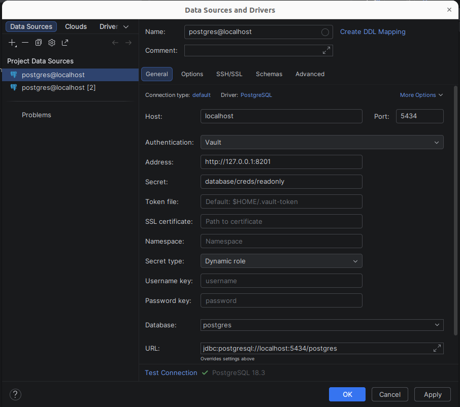

# datagrip-vault-plugin


[](https://plugins.jetbrains.com/plugin/18522)
[](https://plugins.jetbrains.com/plugin/18522)

<!-- Plugin description -->

This plugin provides database credentials using [Vault dynamic secrets](https://www.vaultproject.io/docs/secrets/databases). 

Vault login is not handled by this plugin. 

You should manually log in into Vault, which will, using the default [Token Helper](https://www.vaultproject.io/docs/commands/token-helper), create a Vault token file in `$HOME/.vault-token`.

The **recommended** way to use this plugin is with a [Vault Agent](https://www.vaultproject.io/docs/agent), with [Auto-Auth](https://www.vaultproject.io/docs/agent/autoauth) and [cache](https://www.vaultproject.io/docs/agent/caching) enabled.
<!-- Plugin description end -->

## Installation

- Using IDE built-in plugin system:
  
  <kbd>Settings/Preferences</kbd> > <kbd>Plugins</kbd> > <kbd>Marketplace</kbd> > <kbd>Search for "datagrip-vault-plugin"</kbd> >
  <kbd>Install Plugin</kbd>
  
- Manually:

  Download the [latest release](https://github.com/premium-minds/datagrip-vault-plugin/releases/latest) and install it manually using
  <kbd>Settings/Preferences</kbd> > <kbd>Plugins</kbd> > <kbd>⚙️</kbd> > <kbd>Install plugin from disk...</kbd>

## Screenshots



## Vault Agent

This plugin will request new credentials everytime a connection is open to the database. To re-use already existing and valid credentials a Vault Agent is recommended.   

This is an example, with [AWS Authenticaton](https://www.vaultproject.io/docs/auth/aws). Save it as `vault-agent-datagrip.hcl` and edit accordingly:
```hcl
auto_auth {
    method "aws" {
        config = {
            type = "iam"
            role = "zzz"
            access_key = "xxx"
            secret_key = "yyy"
            header_value = "https://vault.example.com"
        }  
    }

    sink "file" {
        config = {
            path = "/opt/vault/vault-token-datagrip"
        }
    }
}

vault {
    address = "https://vault.example.com"
}

cache {  
    use_auto_auth_token = true
}

listener "tcp" {
    address = "127.0.0.1:8101"
    tls_disable = true
}
```

Launch the Vault Agent with `vault agent -log-level=debug -config vault-agent-datagrip.hcl`. 

Configure a DataGrip database connection with:
 * `Address: 127.0.0.1:8101`
 * `Token file: /opt/vault/vault-token-datagrip`

### Launching Vault Agent automatically

To skip launching the Vault Agent manually, you can configure your system manager to launch it on startup. For `systemd` create a `/etc/systemd/system/vault-agent-datagrip.service` with:
```desktop
[Unit]
Description="Vault Agent to serve Tokens - DataGrip"

[Service]
User=froque
WorkingDirectory=/opt/vault
ExecStart=/usr/bin/vault agent -config=/opt/vault-agent-datagrip.hcl
Restart=always

[Install]
WantedBy=multi-user.target
```

Launch the Vault Agent with `sudo systemctl start vault-agent-datagrip`.
